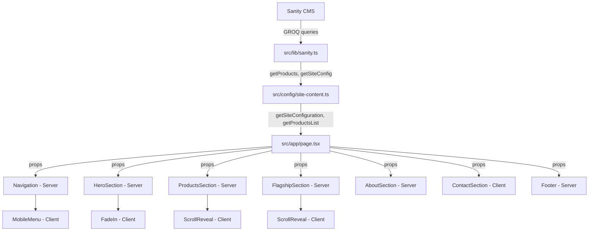

# Design Document: OfekLabs Landing Page

## Overview

The OfekLabs landing page is a single-page application built with Next.js 16 (App Router) that renders seven sequential sections — Navigation, Hero, Products, Flagship Highlight, About, Contact, and Footer. All content is fetched from Sanity CMS at request time using `force-dynamic` rendering. The page follows a Server Component–first architecture where only components requiring browser APIs (scroll listeners, form state, animations) are marked as Client Components.

The data flow is unidirectional: Sanity CMS → `src/lib/sanity.ts` (GROQ queries) → `src/config/site-content.ts` (data fetching with fallback) → `src/app/page.tsx` (Server Component orchestrator) → section components (receive data as props). This ensures a clean separation between data fetching and presentation.

The design targets a Lighthouse score of 95+ on both Performance and Accessibility by leveraging Server Components for zero client-side JS where possible, native lazy loading for below-fold images, and a minimal client bundle limited to Framer Motion animations and form interactivity.

## Architecture

### Rendering Strategy



### Component Rendering Decisions

| Component | Rendering | Reason |
|-----------|-----------|--------|
| `page.tsx` | Server | Data fetching orchestrator |
| `Navigation` | Server | Static content, no interactivity |
| `MobileMenu` | Client | Toggle state, click handlers |
| `HeroSection` | Server | Static content wrapper |
| `ProductsSection` | Server | Static grid layout |
| `FlagshipSection` | Server | Static content |
| `AboutSection` | Server | Static content |
| `ContactSection` | Client | Form state, validation, submission |
| `Footer` | Server | Static content |
| `ScrollReveal` | Client | IntersectionObserver, Framer Motion |
| `FadeIn` | Client | Framer Motion animation |
| `ProductCard` | Server | Static card, wrapped by ScrollReveal |

### Fallback Strategy

The system uses a two-tier fallback approach:

1. **Query-level fallback** (`src/lib/sanity.ts`): If the Sanity client throws or the project ID is missing, functions return `null` (for siteConfig) or `[]` (for products).
2. **Application-level fallback** (`src/config/site-content.ts`): If the query returns null/empty, a `DEFAULT_SITE_CONFIG` object provides complete content for all sections.

This ensures the page always renders a complete layout even when Sanity is completely unavailable.

## Components and Interfaces

### File Structure

```
src/
├── app/
│   ├── page.tsx                    # Home page (force-dynamic, data orchestrator)
│   ├── layout.tsx                  # Root layout (Geist font, metadata)
│   ├── globals.css                 # Tailwind v4 imports + CSS variables
│   └── studio/[[...tool]]/page.tsx # Sanity Studio (existing)
├── components/
│   ├── sections/
│   │   ├── Navigation.tsx          # Server Component
│   │   ├── HeroSection.tsx         # Server Component
│   │   ├── ProductsSection.tsx     # Server Component
│   │   ├── FlagshipSection.tsx     # Server Component
│   │   ├── AboutSection.tsx        # Server Component
│   │   ├── ContactSection.tsx      # Client Component
│   │   └── Footer.tsx              # Server Component
│   ├── ui/
│   │   ├── Button.tsx              # Reusable button (Server)
│   │   ├── ProductCard.tsx         # Product card (Server)
│   │   ├── Badge.tsx               # Status badge (Server)
│   │   ├── SocialLinks.tsx         # Social icon links (Server)
│   │   └── Container.tsx           # Max-width wrapper (Server)
│   └── motion/
│       ├── ScrollReveal.tsx        # Client: IntersectionObserver + fade-in
│       ├── FadeIn.tsx              # Client: Initial load fade-in
│       └── MobileMenu.tsx          # Client: Mobile nav toggle
├── config/
│   ├── site-content.ts             # CMS data fetching + fallback (existing)
│   └── urls.ts                     # URL centralization (existing)
├── lib/
│   ├── sanity.ts                   # Sanity client + GROQ queries (existing)
│   └── utils.ts                    # Utility functions (cn, truncate)
├── types/
│   └── index.ts                    # All TypeScript type definitions
└── sanity/
    └── schemaTypes/                # Sanity schemas (existing)
```

### Component Interfaces

#### page.tsx (Server Component — Orchestrator)

```typescript
// src/app/page.tsx
export const dynamic = 'force-dynamic';

export default async function HomePage() {
  const [siteConfig, products] = await Promise.all([
    getSiteConfiguration(),
    getProductsList(),
  ]);

  const flagship = products.length > 0 ? products[0] : null; // lowest order = first

  return (
    <>
      <Navigation config={siteConfig} />
      <main>
        <HeroSection config={siteConfig} />
        <ProductsSection products={products} />
        {flagship && <FlagshipSection product={flagship} />}
        <AboutSection config={siteConfig} />
        <ContactSection config={siteConfig} />
      </main>
      <Footer config={siteConfig} />
    </>
  );
}
```

#### Navigation

```typescript
interface NavigationProps {
  config: SiteConfig;
}
// Renders: logo, section links, CTA button
// Delegates mobile menu to MobileMenu client component
```

#### HeroSection

```typescript
interface HeroSectionProps {
  config: SiteConfig;
}
// Renders: headline, subheadline, CTA button with FadeIn wrapper
```

#### ProductsSection

```typescript
interface ProductsSectionProps {
  products: Product[];
}
// Renders: section title + grid of ProductCard components
// Does not render if products array is empty
```

#### FlagshipSection

```typescript
interface FlagshipSectionProps {
  product: Product;
}
// Renders: product title, description, screenshot, features list, CTA
```

#### AboutSection

```typescript
interface AboutSectionProps {
  config: SiteConfig;
}
// Renders: company description (max 3 sentences)
// Does not render if description is empty/missing
```

#### ContactSection (Client Component)

```typescript
interface ContactSectionProps {
  config: SiteConfig;
}
// Renders: email link, social links, optional contact form
// Manages form state, validation, and submission
```

#### Footer

```typescript
interface FooterProps {
  config: SiteConfig;
}
// Renders: logo, nav links, social links, legal links, copyright
```

### Animation Components

#### ScrollReveal (Client Component)

```typescript
interface ScrollRevealProps {
  children: React.ReactNode;
  delay?: number; // stagger delay in ms (default: 0)
  className?: string;
}
// Uses IntersectionObserver to detect viewport entry
// Applies Framer Motion fade-in (opacity 0→1, translateY 20px→0)
// Duration: 400-600ms, ease-out
// Respects prefers-reduced-motion: renders children immediately
```

#### FadeIn (Client Component)

```typescript
interface FadeInProps {
  children: React.ReactNode;
  duration?: number; // ms (default: 400)
  delay?: number;    // ms (default: 0)
}
// Framer Motion initial load animation
// Respects prefers-reduced-motion
```

#### MobileMenu (Client Component)

```typescript
interface MobileMenuProps {
  links: Array<{ label: string; href: string }>;
  ctaText: string;
  ctaHref: string;
}
// Toggle state for mobile hamburger menu
// Smooth open/close animation
// Closes on link click or outside click
```

## Data Models

### TypeScript Type Definitions

```typescript
// src/types/index.ts

/** Site configuration from Sanity CMS siteConfig document */
export interface SiteConfig {
  name: string;
  tagline?: string;
  description?: string;
  domain?: string;
  email?: string;
  contact: {
    email: string;
    whatsapp?: string;
    phone?: string;
  };
  socials: {
    github?: string;
    linkedin?: string;
    twitter?: string;
  };
  legal?: {
    privacy?: string;
    terms?: string;
  };
  hero?: {
    headline: string;
    subheadline: string;
    ctaText: string;
    ctaTarget: string; // section ID or external URL
  };
}

/** Product document from Sanity CMS */
export interface Product {
  id: string;
  name: string;
  tagline?: string;
  description?: string;
  status: 'active' | 'beta' | 'dev' | 'coming-soon';
  badge: string;
  url: string;
  features: string[];
  screenshot?: SanityImage | null;
  order?: number;
}

/** Sanity image reference */
export interface SanityImage {
  _type: 'image';
  asset: {
    _ref: string;
    _type: 'reference';
  };
  hotspot?: {
    x: number;
    y: number;
    height: number;
    width: number;
  };
}

/** Contact form data */
export interface ContactFormData {
  name: string;
  email: string;
  message: string;
}

/** Contact form validation errors */
export interface ContactFormErrors {
  name?: string;
  email?: string;
  message?: string;
}

/** Navigation link item */
export interface NavLink {
  label: string;
  href: string;
}

/** Default fallback configuration (complete for all sections) */
export interface DefaultSiteConfig {
  name: string;
  domain: string;
  email: string;
  contact: {
    email: string;
    whatsapp: string;
    phone: string;
  };
  socials: {
    github: string;
    linkedin: string;
  };
  hero: {
    headline: string;
    subheadline: string;
    ctaText: string;
    ctaTarget: string;
  };
  description: string;
}
```

### Sanity GROQ Queries

The existing `src/lib/sanity.ts` already provides the core queries. The `siteConfig` query needs to be extended to include hero content:

```groq
// Extended siteConfig query
*[_type == "siteConfig"][0] {
  name,
  tagline,
  description,
  email,
  whatsapp,
  phone,
  socials {
    github,
    linkedin,
    twitter
  },
  legal {
    privacy,
    terms
  },
  hero {
    headline,
    subheadline,
    ctaText,
    ctaTarget
  }
}
```

```groq
// Products query (existing, already ordered)
*[_type == "product"] | order(order asc) {
  "id": id.current,
  "name": title,
  tagline,
  description,
  status,
  badge,
  url,
  features,
  screenshot,
  order
}
```

### Sanity Schema Extensions

The `siteConfig` schema needs a `hero` field group added:

```typescript
// Additional fields for siteConfig schema
{
  name: 'hero',
  title: 'Hero Section',
  type: 'object',
  fields: [
    { name: 'headline', title: 'Headline', type: 'string', validation: (Rule) => Rule.max(80) },
    { name: 'subheadline', title: 'Subheadline', type: 'string', validation: (Rule) => Rule.max(160) },
    { name: 'ctaText', title: 'CTA Button Text', type: 'string', validation: (Rule) => Rule.max(30) },
    { name: 'ctaTarget', title: 'CTA Target', type: 'string', description: 'Section ID (e.g., #products) or external URL' },
  ]
}
```

### Default Fallback Configuration (Extended)

```typescript
const DEFAULT_SITE_CONFIG: DefaultSiteConfig = {
  name: "OfekLabs",
  domain: "ofeklabs.com",
  email: "ofeklabs@outlook.com",
  contact: {
    email: "ofeklabs@outlook.com",
    whatsapp: "",
    phone: "",
  },
  socials: {
    github: "https://github.com/ofekitzhaki",
    linkedin: "https://linkedin.com/in/ofekitzhaki",
  },
  hero: {
    headline: "Software that works as hard as you do",
    subheadline: "We build tools for productivity, automation, and workflow management.",
    ctaText: "Explore Products",
    ctaTarget: "#products",
  },
  description: "OfekLabs builds developer-first productivity tools. We focus on quality, reliability, and seamless workflows that help teams ship faster.",
};
```

### SEO Metadata Generation

```typescript
// src/app/layout.tsx — generateMetadata approach
import { Metadata } from 'next';
import { getSiteConfiguration } from '@/config/site-content';
import { getBaseUrl } from '@/config/urls';

export async function generateMetadata(): Promise<Metadata> {
  const config = await getSiteConfiguration();
  const baseUrl = getBaseUrl();

  const title = truncate(
    config.tagline ? `${config.name} | ${config.tagline}` : config.name,
    60
  );
  const description = truncate(config.description || config.name, 155);

  return {
    title,
    description,
    metadataBase: new URL(baseUrl),
    alternates: { canonical: '/' },
    openGraph: {
      title,
      description,
      url: baseUrl,
      siteName: config.name,
      images: [{ url: '/og-image.png', width: 1200, height: 630 }],
      type: 'website',
    },
    twitter: {
      card: 'summary_large_image',
      title,
      description,
      images: ['/og-image.png'],
    },
  };
}
```

### Responsive Design Strategy

The page uses Tailwind CSS v4 with a mobile-first approach:

| Breakpoint | Width | Layout Changes |
|------------|-------|----------------|
| Base | < 640px | Single column, stacked sections, mobile nav |
| `sm` | ≥ 640px | Minor spacing adjustments |
| `md` | ≥ 768px | Two-column product grid, desktop nav, side-by-side flagship |
| `lg` | ≥ 1024px | Wider container, larger typography |
| `xl` | ≥ 1280px | Max-width container (1280px), comfortable spacing |

All tap targets on mobile are minimum 44×44px with 8px spacing between adjacent targets.

### Animation Approach

Animations use Framer Motion with IntersectionObserver for scroll-triggered reveals:

1. **ScrollReveal wrapper**: A Client Component that wraps section content. Uses `useInView` from Framer Motion (which internally uses IntersectionObserver) to trigger a fade-in + slide-up animation when the element enters the viewport.
2. **prefers-reduced-motion**: Checked via `useReducedMotion()` hook from Framer Motion. When enabled, all animations are skipped and content renders immediately.
3. **Performance**: Animations use `transform` and `opacity` only (GPU-accelerated, no layout thrashing). No particle effects, 3D transforms, or cursor-tracking.
4. **Timing**: 300–700ms duration, ease-out curve, optional stagger delay for grid items.

## Correctness Properties

*A property is a characteristic or behavior that should hold true across all valid executions of a system — essentially, a formal statement about what the system should do. Properties serve as the bridge between human-readable specifications and machine-verifiable correctness guarantees.*

### Property 1: Fallback configuration completeness

*For any* response from Sanity CMS that is null, undefined, or an error, `getSiteConfiguration()` SHALL return a complete configuration object satisfying the `DefaultSiteConfig` interface with non-empty values for name, domain, email, contact.email, socials.github, socials.linkedin, hero.headline, hero.subheadline, hero.ctaText, hero.ctaTarget, and description.

**Validates: Requirements 1.2, 1.5**

### Property 2: CTA target classification

*For any* string that starts with `#`, the CTA link SHALL be rendered as an in-page scroll target (anchor link). *For any* string that starts with `http://` or `https://`, the CTA link SHALL be rendered as an external link opening in a new tab. The classification function SHALL never produce an ambiguous result.

**Validates: Requirements 3.5, 3.6**

### Property 3: Product ordering invariant

*For any* array of Product objects with various `order` values (including undefined), sorting by the `order` field ascending SHALL produce an array where every element's order value is less than or equal to the next element's order value, and all products with undefined/null order values appear after all products with defined order values.

**Validates: Requirements 4.3, 5.3**

### Property 4: Sentence truncation

*For any* input string, `truncateToSentences(input, 3)` SHALL return a string containing at most 3 sentence-ending punctuation marks (`.`, `!`, `?`) and the output SHALL be a prefix of the original string (no content is added or reordered).

**Validates: Requirements 6.2**

### Property 5: Conditional link rendering

*For any* `SiteConfig` object with an arbitrary subset of social links (github, linkedin, twitter) and legal links (privacy, terms) populated with non-empty URL strings, the rendered output SHALL contain exactly those links whose URL value is a non-empty string, and SHALL omit all links whose URL is empty, undefined, or null.

**Validates: Requirements 7.2, 8.4**

### Property 6: Contact form validation

*For any* `ContactFormData` object, `validateContactForm(data)` SHALL return errors for exactly the fields that are invalid: name is invalid if empty, email is invalid if it does not match a standard email format, message is invalid if fewer than 10 characters. If all fields are valid, the function SHALL return no errors.

**Validates: Requirements 7.4, 7.6**

### Property 7: Copyright notice formatting

*For any* non-empty company name string, `formatCopyright(name)` SHALL produce a string matching the pattern `© {currentYear} {name}` where `{currentYear}` is the four-digit current year.

**Validates: Requirements 8.3**

### Property 8: URL path normalization

*For any* path string, `buildFullUrl(path)` SHALL produce a URL that contains no consecutive forward slashes after the protocol (`://`), contains no trailing forward slash, and starts with the base URL.

**Validates: Requirements 9.1, 14.1**

### Property 9: Product URL lookup

*For any* array of product objects and *any* product ID string: if the ID matches a product in the array, `getProductUrl(id, products)` SHALL return that product's `url` field value; if the ID does not match any product, it SHALL return `null`.

**Validates: Requirements 9.2, 9.3, 14.3**

### Property 10: Base URL trailing slash normalization

*For any* environment variable value for `NEXT_PUBLIC_SITE_URL` that contains one or more trailing slashes, `getBaseUrl()` SHALL return the URL with all trailing slashes removed.

**Validates: Requirements 9.5**

### Property 11: String truncation to maximum length

*For any* input string and *any* positive integer maximum length, `truncate(input, maxLength)` SHALL return a string whose length is at most `maxLength` characters. If the input length is less than or equal to `maxLength`, the output SHALL equal the input.

**Validates: Requirements 12.1, 12.2**

### Property 12: buildFullUrl whitespace handling

*For any* string composed entirely of whitespace characters (spaces, tabs, newlines), `buildFullUrl(str)` SHALL return exactly `getBaseUrl()` — the base URL with no trailing slash and no path appended.

**Validates: Requirements 14.2**

### Property 13: buildFullUrl round-trip

*For any* valid path string containing only alphanumeric characters, hyphens, underscores, and forward slashes, constructing a full URL with `buildFullUrl(path)` and then extracting the pathname portion SHALL produce the original path normalized to have exactly one leading slash and no trailing slash.

**Validates: Requirements 14.5**

## Error Handling

### Sanity CMS Failures

| Failure Mode | Handling Strategy |
|---|---|
| Network timeout (>5s) | `sanity.ts` catches error, returns `null`/`[]` |
| HTTP error status | Same as timeout — caught, returns fallback |
| Empty dataset | `site-content.ts` detects null/empty, uses `DEFAULT_SITE_CONFIG` |
| Missing project ID | Early return in query functions, returns `null`/`[]` |
| Malformed response | Type narrowing in `site-content.ts`, falls back to defaults |

### Contact Form Errors

| Error Type | User Experience |
|---|---|
| Client-side validation failure | Inline error messages adjacent to invalid fields, form not submitted |
| Network error on submission | Error toast/message, all field data retained |
| Server error (5xx) | Error message indicating temporary issue, retry suggestion |
| Success | Success confirmation message, form fields cleared |

### URL Module Errors

| Error Type | Handling |
|---|---|
| Invalid product ID | Returns `null` (caller decides how to handle) |
| Missing env variable | Falls back to `https://ofeklabs.com` |
| Malformed path input | Normalizes slashes, strips whitespace |

### General Principles

- **No error UI for CMS failures**: The visitor never sees an error state. Fallback content renders seamlessly.
- **Graceful degradation**: Sections with no data simply don't render (Products, Flagship, About).
- **Form errors are recoverable**: User data is never lost on submission failure.
- **Console warnings for developers**: CMS failures log warnings to console for debugging without affecting UX.

## Testing Strategy

### Testing Framework

- **Unit & Property Tests**: Vitest + fast-check (already configured in `vitest.config.ts`)
- **Component Tests**: Vitest with React Testing Library (for component rendering verification)
- **E2E Tests**: Playwright (for responsive layout, scroll behavior, Lighthouse)

### Property-Based Tests (fast-check)

Each correctness property maps to a single property-based test with minimum 100 iterations:

| Property | Test File | What It Generates |
|---|---|---|
| P1: Fallback completeness | `src/__tests__/config/site-content.test.ts` | Random null/undefined/error responses |
| P2: CTA target classification | `src/__tests__/lib/utils.test.ts` | Random strings with # or http prefixes |
| P3: Product ordering | `src/__tests__/lib/utils.test.ts` | Random product arrays with various order values |
| P4: Sentence truncation | `src/__tests__/lib/utils.test.ts` | Random multi-sentence strings |
| P5: Conditional link rendering | `src/__tests__/components/social-links.test.ts` | Random config objects with subset of links |
| P6: Form validation | `src/__tests__/components/contact-form.test.ts` | Random ContactFormData objects |
| P7: Copyright formatting | `src/__tests__/components/footer.test.ts` | Random company name strings |
| P8: URL normalization | `src/__tests__/config/urls.test.ts` | Random path strings with various slash patterns |
| P9: Product URL lookup | `src/__tests__/config/urls.test.ts` | Random product arrays + random IDs |
| P10: Base URL trailing slash | `src/__tests__/config/urls.test.ts` | Random URLs with trailing slashes |
| P11: String truncation | `src/__tests__/lib/utils.test.ts` | Random strings + random max lengths |
| P12: Whitespace handling | `src/__tests__/config/urls.test.ts` | Random whitespace-only strings |
| P13: Round-trip | `src/__tests__/config/urls.test.ts` | Random valid path strings |

**Configuration**: Each property test runs with `{ numRuns: 100 }` minimum.

**Tag format**: Each test includes a comment:
```typescript
// Feature: ofeklabs-landing-page, Property {N}: {property_text}
```

### Unit Tests (Example-Based)

| Area | Test File | Coverage |
|---|---|---|
| Navigation rendering | `src/__tests__/components/navigation.test.ts` | Logo, links, CTA from config |
| Hero rendering | `src/__tests__/components/hero.test.ts` | Headline, subheadline, CTA |
| ProductCard rendering | `src/__tests__/components/product-card.test.ts` | All fields displayed |
| Flagship rendering | `src/__tests__/components/flagship.test.ts` | Features, screenshot, CTA |
| About conditional render | `src/__tests__/components/about.test.ts` | Renders/hides based on description |
| Footer rendering | `src/__tests__/components/footer.test.ts` | All sections present |
| Metadata generation | `src/__tests__/app/metadata.test.ts` | Title, description, OG tags |

### Edge Case Tests

| Case | Test |
|---|---|
| Empty products array | ProductsSection returns null |
| No flagship product | FlagshipSection not rendered |
| Missing description | AboutSection returns null |
| Missing contact email | Email area hidden |
| Product with no screenshot | Renders without image |
| Features array with 1-2 items | All display without minimum |
| prefers-reduced-motion | Animations disabled |

### Integration / E2E Tests (Playwright)

| Scenario | What It Verifies |
|---|---|
| Full page render | All sections visible with Sanity data |
| Mobile responsive | Nav collapses, grid stacks, tap targets sized |
| Scroll navigation | Section links scroll to correct positions |
| Contact form flow | Submit → success/error states |
| Lighthouse audit | Performance ≥ 95, Accessibility ≥ 95 |

### Test Execution

```bash
# Run all unit + property tests
npm run test

# Run in watch mode during development
npm run test:watch

# Run E2E tests (requires dev server)
npx playwright test
```

